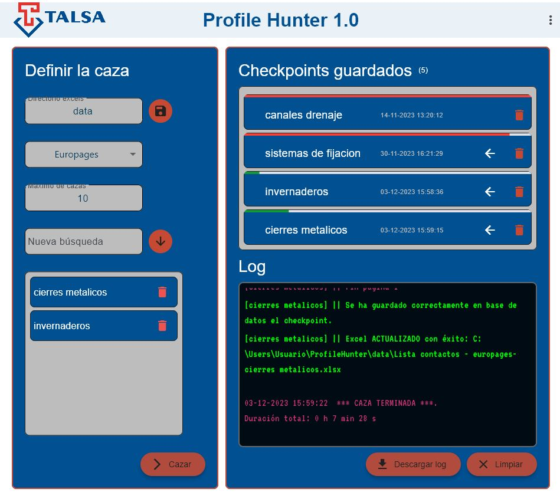

# Profile Hunter
# Aplicación para TALSA para encontrar potenciales clientes consumidores de perfil metálico
# 🌐🗺️🧲🖋️🧾
La idea de la aplicación es la siguiente:
- Mediante unos parámetros de entrada como paises, sectores y alguno más, realizará una búsqueda por páginas donde se listan empresas que cumplan dichos requisitos
- El programa extraerá información de dichas páginas con **Selenium**  : email de contacto, nombre empresa, idioma, web etc.
- Se creará un DataFrame con **pandas** con toda la información que podrá descargarse en formato excel
- Dicho excel podrá alimentar la aplicación [pSK](https://talsa-mailing.streamlit.app/) para hacer un mailing a todos los contactos.
- Se realizará un IU amigable con **Flet**

## App

## Uso
- Si es la primera vez que ejecutas la app se mostrará un mensaje de bienvenida y unas instrucciones
- Síguelas paso a paso
- Escribe un sector y agrégalo a la búsqueda.
- Puedes hacer una búsqueda simultánea con hasta 4 sectores
- Los archivos Excels generado se guardan en la ruta mostrada en las instrucciones
- Esta aplicación combina con **PsK Mailing** también para TALSA.

## Mejoras a implementar
- Cambiar colores de avance de checkpoints, todos en verde
- Cuando un checkpoint ha alcanzado el 100%, cambiar icono de añadir a búsqueda por 'comprobar actualizaciones' que lo que haga sea comprobar que el número máximo de empresas con ese sector sea el mismo que el guardado en base de datos [DONE]
- Añadir la funcionalidad del nuevo botón